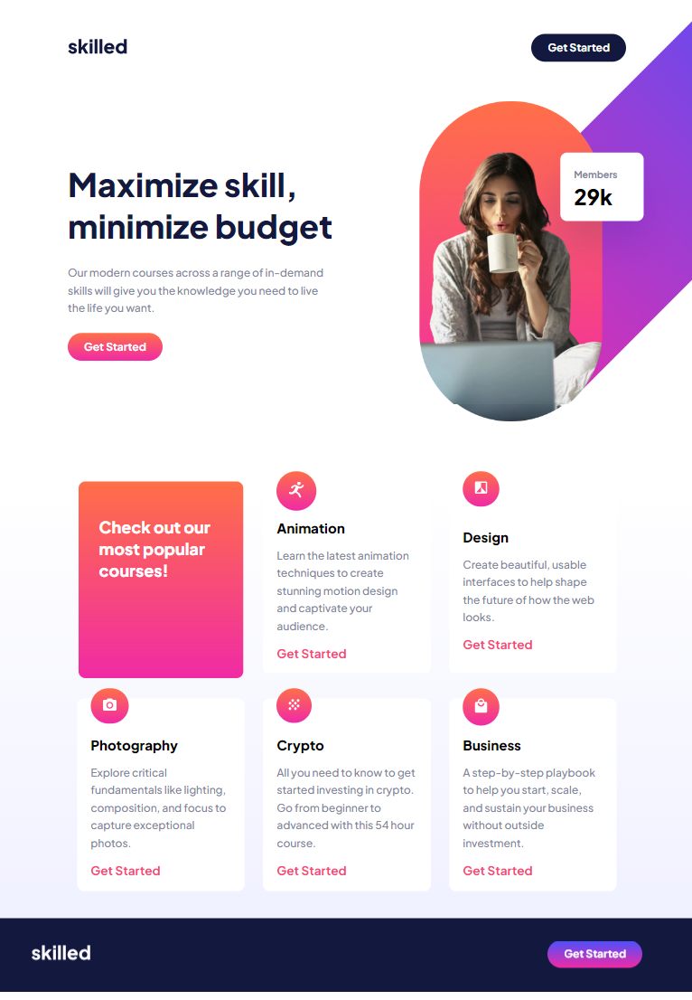

# eLearning Landing Page (Practice)

This repository contains the source code for a practice eLearning landing page, a mockup for learning purposes.

## Description

This project is a practice eLearning landing page designed to showcase a responsive and intuitively navigable interface. Please note that the links are not functional as this is a practice project.

## Screenshots

## Features

- **Responsive Design:** The page is designed to be responsive across various devices.
- **Intuitive Navigation:** User-friendly interface for easy navigation.
- **Technologies Used:** HTML, CSS.

## Link
https://elearninglandingpage.netlify.app/
 

